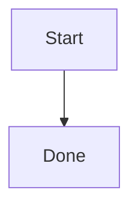

# MD Viewer

A native macOS Markdown viewer built with Swift and SwiftUI.

MD Viewer is focused on opening local `.md` files quickly, rendering them in a clean reading view, and keeping Persian/RTL documents readable. It also includes source view tools for quick inspection and find/replace.

## Features

- Open Markdown files from the file picker.
- Drag and drop `.md` files into the app.
- Preview-first interface with optional source/code view.
- Selectable text in preview.
- Persian-friendly typography with bundled Vazirmatn.
- GitHub-style Markdown basics:
  - headings
  - paragraphs
  - ordered and unordered lists
  - nested task lists
  - fenced code blocks
  - pipe tables
  - raw HTML tables
  - images
- Task list rendering for `[ ]` and `[x]`.
- Mermaid diagram rendering with zoom, pan, and fullscreen view.
- Find and replace in the source view.
- Export rendered content as HTML.
- DMG packaging script for installing the app on macOS.

## Requirements

- macOS 14 or newer
- Swift 6 toolchain
- Xcode Command Line Tools

Install Xcode Command Line Tools if needed:

```bash
xcode-select --install
```

## Run From Source

```bash
./run.sh
```

You can also pass a Markdown file path:

```bash
./run.sh ~/Documents/notes.md
```

## Build

```bash
swift build
```

For a release build:

```bash
swift build -c release
```

## Create a DMG

```bash
./package-dmg.sh
```

The generated app and installer will be placed in:

```text
dist/MD Viewer.app
dist/MD Viewer.dmg
```

To install manually, drag `MD Viewer.app` into `/Applications`, or copy it with:

```bash
rm -rf "/Applications/MD Viewer.app"
ditto "dist/MD Viewer.app" "/Applications/MD Viewer.app"
```

## Markdown Notes

MD Viewer currently uses a native SwiftUI renderer with custom handling for Persian/RTL text, task lists, tables, code blocks, and Mermaid diagrams.

Mermaid blocks are supported with fenced code:

````markdown

````

Task lists are rendered as checkboxes:

```markdown
- [x] Create pnpm workspace
  - [x] Add root package.json
  - [ ] Add CI workflow
```

## Project Structure

```text
Sources/mdViewer/
  AppDelegate.swift
  ContentView.swift
  MarkdownEditor.swift
  MarkdownInline.swift
  MarkdownPreview.swift
  Resources/
    AppIcon.icns
    Fonts/Vazirmatn-Regular.ttf
    mermaid.min.js
```

## License

Private project.
